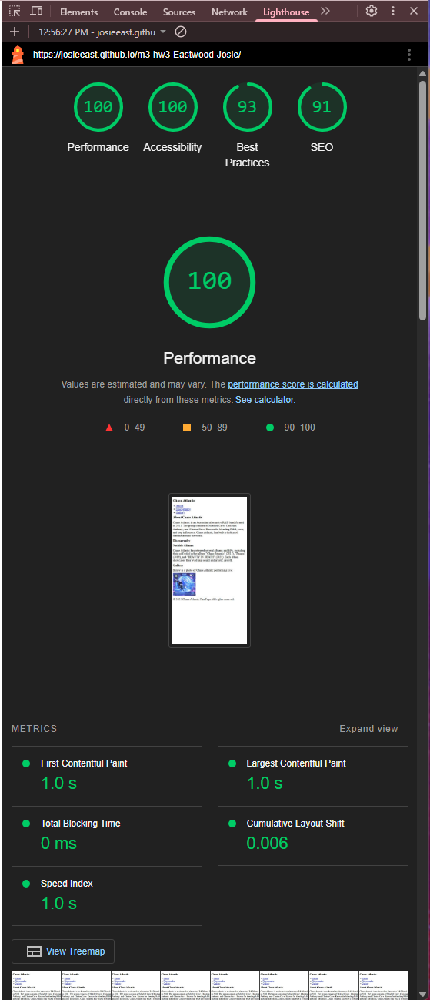

# Chase Atlantic Webpage

## About

This project is a simple HTML webpage created to showcase my favorite artist, Chase Atlantic.  
The webpage includes properly structured HTML elements like headings (`h1` to `h3`), `header`, `main`, `footer`, `section`, `nav`, `article`, and an embedded image.  

## Features

- Single `h1` heading
- Organized sections using `h2` and `h3` headings
- Navigation bar with relative links
- About section, discography section, and image gallery
- Image of Chase Atlantic (small-sized and optimized)
- Semantic HTML tags for clean, organized structure

## Lighthouse Report

I have included an image of my Lighthouse report to show the performance and quality checks of the webpage.  
The Lighthouse report screenshot is saved as:  
`lighthouse-report.png`

## How to View

Open the `index.html` file in a web browser to view the webpage.

---

Created for academic purposes.
